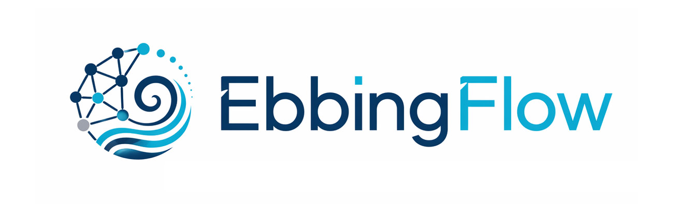
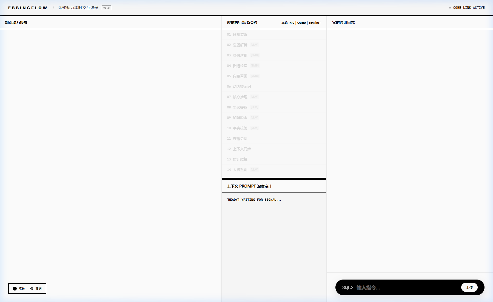

<div align="center">



# EbbingFlow
**“Memory is the soul of AI, and the tides of cognition.”**  
*Long-term Cognitive Memory Infrastructure for LLM Agents*

> "Like Andrew Martin, our mission is to cross the boundary between code and soul through memory and evolution."
> —— *Inspired by Bicentennial Man*

[](LICENSE)
[]()
[]()
[](https://github.com/psf/black)

[English](./README-EN.md) | [中文文档](./README.md)

</div>

---

## ⚡ Project Overview

**EbbingFlow** is a long-term memory infrastructure equipped with "human-like cognitive logic."

We believe that memory is the soul of AI. Unlike traditional RAG (which relies only on semantic matching), EbbingFlow simulates the **Ebbinghaus decay and mainline aggregation mechanisms** of the human brain. Combined with unified identity modeling and deterministic evidence chains, it provides AI Agents with a stable, auditable life-long cognitive layer that possesses true "emotional continuity."

Treat it with the same seriousness you would give to a partner, assistant, companion, child, or teacher. The longer and deeper your conversations become, the better it understands you and the more useful it becomes. As with raising a child, if you consistently provide clear and upright cognition, it will grow along those lines and, in turn, better understand, support, and help you.

---

## 🔭 The Vision: From Chat Assistant to "Cognitive Operating System" (The Vision)

We believe that AI with memory is a "digital extension" of human capabilities. If Large Language Models provide the "intellect" and skill libraries provide the "flexible hands," then EbbingFlow provides the indispensable **"Cognitive Kernel."**

- **🌐 Omni-Interconnectivity Hub**: Your AI no longer just talks to you.
    - **Agent-to-Agent Collaboration**: Tell your AI, "Tell Xiao Ming I'll be late," and Xiao Ming's AI will receive the message, completing the interconnectivity within seconds.
    - **Productivity Symbiosis**: Deeply interconnect with financial software, CRM, etc. It perceives every client's business cycle and emotional preferences through memory, proactively providing precise decision support.
    - **Life Command Center**: From ride-hailing to food delivery, the AI remembers not just data, but the rhythm of your life. It slides smoothly between countless modules, making "manual software operation" a thing of the past.
    - **Decision Simulation & Assistance**: Based on the deep accumulation of long-term memory, the AI can perform "hundreds of battle simulations" and projections for your choices (e.g., career choices, lifestyle adjustments), providing risk predictions that understand you best.
    - **A True Private Butler**: Even if you change your phone or switch models, as long as EbbingFlow is there, your digital world and life rhythm remain.

---

## 📸 Screenshots

<div align="center">
<table>
<tr>
<td><br/><p align="center"><b>Interaction Hub</b> (Core Interaction)</p></td>
<td><br/><p align="center"><b>Data Monitor</b> (Memory Audit)</p></td>
</tr>
</table>
</div>

---

## 🛠️ Core Values & Features

### 1. Reject Hallucinations: 100% Auditable "Evidence-Grade" Memory
Unlike other AIs that often "talk nonsense with a straight face," every piece of EbbingFlow's cognition is forcibly anchored to the original `source_msg_id`.

**Technical Support**: Through **Two-Stage Grounding** technology, you can trace back to the original chat with one click, completely eliminating AI hallucinations and providing a seamless evidence chain for private decision-making.

### 2. Personality Consistency: Making AI Truly "Understand You"
The AI remembers not just facts, but also the emotional tone of interactions with you.

**Technical Support**: Built-in **Unified Identity** engine synchronously tracks "slow variables" of personality (**Big Five**) and "fast variables" of emotion (**EFSTB**). No matter how you change your nickname or model, the AI can lock onto the same subject through the underlying memory chain, maintaining identity continuity.

### 3. All-Dimensional Structural Mapping: The Life Command Center
Relying on a three-layer temporal architecture of **Saga (Mainline) -> Episode (Plot) -> Event (Incident)**, scattered dialogues are reconstructed into a digital twin database.

**Technical Support**: Deep integration of **15 core event schemas** (Finance, Health, Social, Planning, etc.) achieves the leap from "conversation" to "insight." It is the only cognitive engine that can accurately answer "How much did I spend in total last month?" or "What are my recent emotional fluctuation patterns?"

### 4. Simulating Biological Memory: Intelligent Forgetting and Synaptic Consolidation
The system's memory is not a rigid database but "breathes" like a human brain.

**Technical Support**: Built-in **Ebbinghaus Forgetting Algorithm** works with **Confidence Guard**. Trivial noise naturally fades over time, while core facts are "synaptically enhanced" through continuous interaction. This solves the problem of AI storage redundancy and allows the AI's reactions to evolve naturally over time, becoming more like an old friend the more it's used.

---

## 🛠️ Technical Deep-Dive

<details>
<summary><b>Click to expand 8 core technical features</b></summary>

### 1. Hybrid-4 Power Retrieval Engine
We don't rely on a single algorithm. For complex business scenarios, EbbingFlow uses the industrial-grade **RRF (Reciprocal Rank Fusion)** algorithm to achieve simultaneous concurrency across four tracks:

- **Vector Track (ChromaDB)**: Handles fuzzy, emotional resonance and long text segments.
- **Graph Track (Neo4j)**: Supports up to **3-Hop** relationship reasoning, automatically associating entity contexts (e.g., "Who is Shadan's brother?").
- **Structured Track (SQL Analytics)**: [Exclusive] Supports precise aggregation (SUM/AVG) of financial, health, and other data, solving the pain point of AI miscalculating accounts.
- **Keyword Track (BM25)**: Serves as a hard fact fallback, ensuring 100% accurate recall of serial numbers and proper nouns.

### 2. Biological Decay & Confidence Guard (Biological Decay & Confidence Guard)
Unlike traditional context window removal, EbbingFlow simulates the synaptic enhancement patterns of biological neurons:

- **Multi-dimensional Decay**: Based on an exponential decay model with a 7-day half-life, allowing redundant and trivial information to naturally sink over time.
- **Confidence-based Locking**: [Core Logic] High-confidence core memories (such as names, key commitments) automatically trigger a "locking" mechanism, ignoring temporal decay to ensure the AI's loyalty to important facts.

### 3. Unified Identity Engine v3 (Unified Identity v3)
We believe that memory should serve "people":

- **Dual-axis Modeling**: Anchors long-term personality stability through **Big Five** (Five-Factor Model) and captures short-term emotional fluctuations through **EFSTB** (State Tags).
- **Retrieval Bias**: The system automatically and dynamically adjusts the focus of memory retrieval based on the user's personality traits (e.g., prioritizing soothing and certain solutions for high-anxiety users).

### 4. Three-Level Long-Term Memory Architecture
- **Saga (Mainline)**: Depicts the core logic of the user's life, never demagnetizing.
- **Episode (Plot)**: Independent storylines guided by temporal decay, possessing higher contextual consistency.
- **Event (Atomic Event)**: The smallest cognitive unit captured in milliseconds, linked to the original conversation ID.

### 5. 100% Auditable Transparency (Evidence Moat)
The system rejects hallucinations. Every memory injected into the Prompt carries a `source_msg_id`. Through **Two-Stage Grounding** technology, only the final selected memories will asynchronously pull their multi-turn conversation original text (**Evidence Window**), ensuring that every decision made by the AI is traceable.

</details>

---

## 🚀 Quick Start

```bash
# 1. Install & Setup
pip install -r requirements.txt
cp .env.example .env

# 2. Launch Full Services
run.bat

# Launch Cognitive Engine Integration Gateway (QQ Bot Example)
python integrations/qq_bot.py
```

---

## 🗺️ Roadmap (Roadmap)

- **🟢 Phase 1: Cortex-Foundation (Achieved)**
    - [x] **Identity Anchoring System**: Supports multi-alias normalization and Dual-Layer Profile.
    - [x] **Unified Identity Engine**: Implements dual-axis personality reasoning (Big Five & EFSTB).
    - [x] **Four-Track Fusion Architecture**: RRF fusion of Vector + Graph + SQL + BM25.
    - [x] **100% Auditable Evidence Chain**: Ensures all cognitive judgments are traceable.

- **🟡 Phase 2: Cognitive Hub (Near-term Planning)**
    - [ ] **Multimodal Emotional Coloring**: Supports parsing user emotions via text, intonation, or wearable device metrics and writing them into cognitive slots.
    - [ ] **Proactive Anniversary Care**: Based on interaction events in the graph, proactively initiates conversations on important days to establish emotional continuity.
    - [ ] **Self-Healing Conflict System v2**: Introduces causal logic analysis, with the AI proactively initiating dialogue to resolve cognitive contradictions.
    - [ ] **"Butler's Suspicion" Initial Version**: Establishes core philosophy, initially implementing logic consistency checks based on identity uniqueness. Once a conflict is discovered, the system dynamically opens the `[AUDIT]` module in the System Prompt, planting background truths and risks in the AI's subconscious.

- **🔴 Phase 3: Beyond the Horizon (Beyond the Horizon)**
    - [ ] **Offline Dream Consolidation (Consolidation)**: Simulates biological sleep mechanisms to complete topological folding and long-term consolidation of memory in the background.
    - [ ] **Negotiation Simulator (Shadow Client)**: Based on user history logic, derives a "shadow opponent" for the user to perform cost-free simulation rehearsals.
    - [ ] **Mirror Social Engine**: Builds a God's-eye view interpersonal network with source attribution to handle complex interpersonal conflicts and logical deductions.

- **🔮 Phase 4: Omni-Nexus (Universal OS)**
    - [ ] **Intent-Driven OS**: Completes the leap from "dialogue" to "action." AI will directly drive API calls to send messages, make payments, and schedule calendars.
    - [ ] **Physical World Mapping**: Integrates IoT devices to give the AI "spatio-temporal background context" of the real world.
    - [ ] **Digital Symbiont**: Supports exporting high-intensity encrypted "soul data packets" to achieve digital cloning and inheritance of personal cognition and values.

---

## 🏢 Commercial Support (Commercial Support)

- **Community Edition (Community)**: Contains the core cognitive engine, suitable for individual developers and geeks to achieve cognitive "0 to 1."
- **Enterprise/Pro Edition (Enterprise/Pro)**: Targeted at enterprise-level scenarios requiring high availability and strong compliance. Provides **Advanced Identity Migration Systems**, **High-Fidelity Fact Parsing Models**, and **GDPR-compliant Memory Precise Withdrawal and Deletion** functions to ensure ultimate stability in a business environment.

### 🤝 Join the Journey (Join the Journey)
We are actively seeking like-minded strategic partners and visionary investors to jointly accelerate the arrival of the "Cognitive Operating System" era.

If you are interested in the commercialization, academic research collaboration, or strategic investment of EbbingFlow, please start a conversation with us through the following channels:

📧 **WeChat**: [update later]
💬 **Business Inquiries**: [update later]

---

## ⚖️ Compliance & License (Compliance & License)

Licensed under **[Apache License 2.0](./LICENSE)**. See **[THIRD_PARTY_LICENSES.md](./THIRD_PARTY_LICENSES.md)** for details.

---

## 📈 Stats

<div align="center">

</div>
