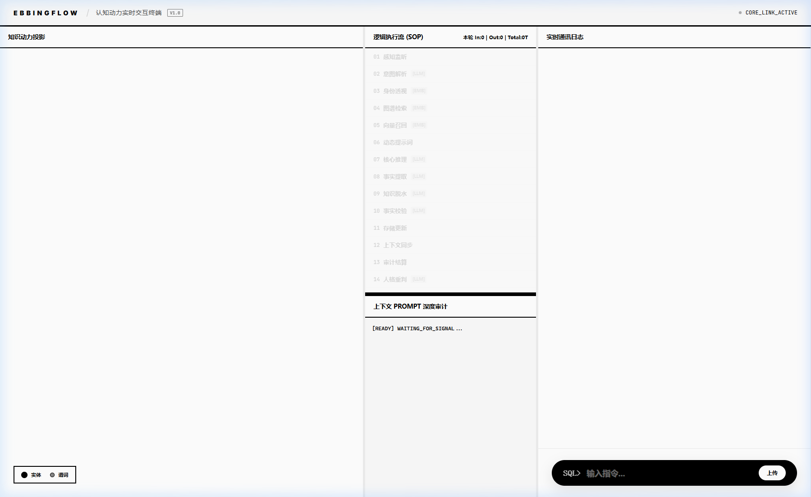

<div align="center">


**真正记得住你、认识你、随你成长的 AI 长效认知记忆引擎**

*Long-term Cognitive Memory Engine for LLM Agents*

> "Like Andrew Martin, our mission is to cross the boundary between code and soul through memory and evolution."
>
> —— *Inspired by Bicentennial Man*

[](LICENSE)
[]()
[]()
[](https://github.com/psf/black)

[English](./README-EN.md) | [中文文档](./README.md)

</div>

---

## 🌐 Online Demo

**Online Demo:** [ebbingflow.net](https://ebbingflow.net)

---

## ⚡ Project Overview

**EbbingFlow** is an AI assistant memory engine that integrates **Knowledge Graphs**, **Temporal Event Memory**, **Multi-Track Retrieval**, **Intelligent Reranking**, and the **Ebbinghaus Forgetting Curve**.

It is not just another chatbot, but an infrastructure layer that provides any LLM with **true long-term memory**: transforming conversations into traceable, auditable, and evolvable cognitive memories.

---

## What Problem Are We Solving?

Current AI memory often relies on simple vector retrieval, which is prone to issues like unverifiability, semantic drift, factual conflicts, and difficulties in long-term maintenance.

EbbingFlow achieves:

### 1. Evidence-Chain Memory

EbbingFlow doesn't just store "model-summarized facts"; it also preserves original chat messages and links **Event**, **Episode**, and **Saga** to the original SQL records via `source_msg_id`.

This means: memory is not a black-box summary, but a cognitive index that can be **100% traced back to the original text**.

### 2. Three-Layer Long-Term Memory

```text
Event   → Atomic Facts: Who did what at what time.
Episode → Plot Chunks: Contextual summaries of continuous dialogues.
Saga    → Long-term Mainlines: Narrative of goals, relationships, and projects over weeks/months.
```

### 3. Intent-Aware Multi-Track Retrieval Fusion

The system simultaneously uses Graph, Vector, SQL, BM25, Structured Events, Episode, Saga, and Plan retrieval. **HybridScorer** first classifies the turn as `fact`, `summary`, `long_term`, or `semantic`, then dynamically adjusts source budgets and multipliers: factual questions prioritize SQL/Graph/Structured Events, while narrative questions can promote Episode/Saga. This keeps long-term continuity without letting summaries override traceable evidence.

### 4. Identity & Persona Continuity

EbbingFlow supports identity anchoring, alias normalization, and profiling based on **Big Five** (slow variables) and **EFSTB** (fast variables), allowing AI to not only remember facts but also maintain long-term consistency in interaction styles.

---

## 🚀 Quick Start

### Prerequisites

| Tool | Version Requirement | Description | Installation Check |
|------|---------|------|---------|
| **Python** | 3.10+ | Core backend runtime | `python --version` |
| **Neo4j** | 4.4+ / 5.x | Graph DB support (Local or AuraDB Cloud) | Access `7474` or Cloud URI |

### Docker One-Click Deployment

Use Docker Compose to start the full stack, including EbbingFlow and Neo4j:

```powershell
.\deploy-docker.ps1
```

Linux/macOS:

```bash
chmod +x ./deploy-docker.sh
./deploy-docker.sh
```

After startup:

- Interaction Hub: http://localhost:8000
- Data Monitor: http://localhost:8000/monitor
- Neo4j Browser: http://localhost:7474

See [Docker one-click deployment](./docs/docker-deploy.md) for configuration and operations.

### 1. Environment Preparation
```powershell
# Create and install dependencies
python -m venv venv
.\venv\Scripts\python.exe -m pip install -r requirements.txt

# Copy example config file
cp .env.example .env
```

### 2. Configuration
Edit the `.env` file and fill in the necessary API keys:

```ini
# LLM API Configuration (Supports any OpenAI-compatible API)
OPENAI_API_KEY=your_api_key
OPENAI_BASE_URL=https://api.openai.com/v1
OPENAI_MODEL=deepseek-v4-flash

# Embedding Configuration (Local or OpenAI API)
# Default [Option A: Local (SentenceTransformers)]
EMBED_TYPE=local
EMBED_MODEL=paraphrase-multilingual-MiniLM-L12-v2
# Recommended [Option C: OpenAI / DashScope Compatible]
EMBED_TYPE=openai
EMBED_MODEL=text-embedding-3-small
EMBED_BASE_URL=https://api.openai.com/v1
EMBED_API_KEY=your_key_here

# Neo4j Database Configuration
NEO4J_URI=bolt://localhost:7687
NEO4J_USERNAME=neo4j
NEO4J_PASSWORD=your_password

# NOTE: If POSTGRES_URL is not configured, the system will automatically fall back to local SQLite.
```

### 3. Startup

**Standard Startup:**
```powershell
.\venv\Scripts\python.exe api\server.py
```

**Quick Start (Windows):**
```powershell
run.bat
```

**Access after startup:**

- Interaction Hub: http://localhost:8000
- Data Monitor: http://localhost:8000/monitor

### 4. OpenAI-Compatible API

After startup, EbbingFlow also exposes a local OpenAI-compatible endpoint for Open WebUI, Cherry Studio, Xiaozhi-style digital humans, and other frontends:

```text
Base URL: http://localhost:8000/v1
Model: ebbingflow
API Key: local
```

If a frontend only accepts a full endpoint URL, use:

```text
http://localhost:8000/v1/chat/completions
```

The backend defaults `model` to `ebbingflow` when it is omitted. Many frontends still require a model name, so enter `ebbingflow` when needed. The local open-source edition does not validate API keys yet; if a frontend requires one, use any placeholder string.

Example:

```powershell
curl http://localhost:8000/v1/chat/completions `
  -H "Content-Type: application/json" `
  -d '{
    "model": "ebbingflow",
    "messages": [
      {"role": "system", "content": "Prefix replies with emotion tags such as <happy> or <thinking>."},
      {"role": "user", "content": "I finished an important feature today."}
    ]
  }'
```

External `system` / `developer` messages are injected into EbbingFlow's main prompt as an `[EXTERNAL_SYSTEM_PROMPT]` block. When connecting another frontend, remove identity, character, and memory-control instructions from its system prompt. Keep only output-format requirements such as emotion tags, speech synthesis constraints, response length, or JSON shape.

See [OpenAI-compatible Chat API](./docs/api-openai-compatible.md) for details.

**QQ Bot Integration (Optional)**

EbbingFlow supports interaction via QQ Bot, allowing for seamless long-term memory synchronization across devices:

1. **Get Credentials**: Log in to the [QQ Open Platform](https://q.qq.com/qqbot/openclaw/), create a bot, and obtain your `AppID` and `AppSecret`.
2. **Configure Environment**: Fill in the credentials in the corresponding fields of your `.env` file.
3. **Launch**:
   ```powershell
   .\venv\Scripts\python.exe integrations\qq_bot.py
   ```
You can now chat with EbbingFlow directly in QQ.

### 5. Experience with Demo Data (Optional)

If you want to quickly preview the system's capabilities, you can import our pre-configured demo: **"Reborn as Zhuge Liang: Building an Empire with EbbingFlow"**.

1. Start the server and access the **Data Monitor**: http://localhost:8000/monitor
2. Click **Import Demo Data** in the top right corner.
3. Confirm the warning, and the system will automatically restore the cognitive state including identity profiles and memory chains.
4. **Note**: Currency conversions between ancient and modern units in this demo may be inconsistent. This is intended to demonstrate EbbingFlow's core advantage: maintaining traceability and robustness even when handling "dirty" or logically flawed input data.
---

## 🎬 Video Demo

**Video Demo:** Coming soon... 

---

## 📸 System Screenshots

<div align="center">
<table>
<tr>
<td><br/><p align="center"><b>Interaction Hub</b> (Core Interaction)</p></td>
<td><br/><p align="center"><b>Data Monitor</b> (Data Audit)</p></td>
</tr>
</table>
</div>

---

## 🔄 Core Architecture

```text
User Input
   │
   ▼
[Identity Recognition / Alias Normalization]
   └── Determine "Who am I / Who are you", resolve pronouns to absolute Actor IDs
   │
   ▼
[Memory Retrieval Engine]
   ├── Graph Atomic Retrieval (Event via Neo4j)
   ├── Graph Narrative Retrieval (Episode + Saga)
   ├── Vector Retrieval (Chroma Vector)
   ├── Keyword Retrieval (BM25)
   ├── Structured Retrieval (SQL Structured Events / CRM)
   └── Plan Retrieval (Plan / Task / Schedule)
   │
   ▼
[Intelligent Reranking: HybridScorer]
   ├── Intent Routing (fact / summary / long_term / semantic)
   ├── Ebbinghaus Time Decay (with Confidence Guard)
   ├── Multi-dimensional Scoring (Semantic / Graph Hops / Time / Impact)
   └── RRF Fusion + Intent-aware Quota Control
       fact prioritizes SQL/Graph/Structured; summary/long_term can promote Episode/Saga
   │
   ▼
[LLM Generation + Evidence Injection]
   ├── Inject only HybridScorer-accepted in_prompt candidates
   ├── SQL Evidence Window Back-injection
   ├── Separate [MEMORY] factual evidence from [NARRATIVE] context
   └── Streaming Output (Traceable to source_msg_id)

──────────────────────────────────────────────

[Ingestion Pipeline (Post-turn processing)]
   ├── 08 Event / Fact Extraction (Event / Relation / Observation / Structured Envelope)
   ├── 09 Persona Observation and Identity Evolution
   ├── 10 Structured Event Normalization / Validation
   ├── 11 Write Graph, SQL, and Episode records (Evidence Chain Binding)
   └── 12 Saga Clustering and Context Synchronization (Long-term Mainlines)
```

---

## 🧠 System Memory & Cognitive Panorama

EbbingFlow is not a simple vector store, but a **hierarchical, auditable, and evolvable** cognitive engine.

### Core Highlights
- **Three-Layer Progressive Memory**: Builds a cognitive abstraction of `Event` → `Episode` → `Saga`, simulating human autobiographical memory.
- **Full Evidence Loop**: Every cognitive judgment can be 100% traced back to the original dialogue via `source_msg_id`, eliminating "black-box summaries."
- **Intent-Aware Retrieval Priority**: Factual questions strongly prefer SQL/Graph/Structured Evidence; Episode/Saga provide narrative context and do not override raw evidence.
- **Persona Continuity**: Integrates Big Five (slow variables) and EFSTB (fast variables) identity profiling, allowing AI to truly "know you" over time.

---

### Cognitive Tiering Table

| Layer | Module | Storage/Index | Data Content | Cognitive Role | Evidence Traceability |
|:---:|---|---|---|---|---|
| **1** | **SQL Storage** | SQLite / PostgreSQL | 1:1 Raw Chat History | Authority, Audit Endpoint | **True Source** |
| **2** | **Event Layer** | Neo4j | Atomic Facts (5W1H) | Detail Index, Entity Reasoning | Linked to SQL |
| **3** | **Episode Layer** | Neo4j | Dialogue Plot Summaries | Mid-term Context Thread | Linked to SQL |
| **4** | **Saga Layer** | Neo4j | Long-term Goals/Mainlines | Factual Stability & Continuity | Linked to SQL |
| **5** | **Vector Track** | ChromaDB | Dialogue/Doc Vector Chunks | Fuzzy Retrieval, Tone Awakening | Auxiliary Index |
| **6** | **Identity Layer** | Neo4j + Session | Big Five / EFSTB Profiles | Consistency & Personalization | Traceable Observations |
| **7** | **HybridScorer** | Scoring Engine | Multi-track Candidate Sets | Intent Routing, Ebbinghaus Decay, RRF & Dynamic Quotas | Auditable Scoring Path |

> [!TIP]
> Every `MemoryEvent` contains `impact_score`, `confidence`, and `source_msg_id`, ensuring that every "nerve ending" of the memory can be traced back to the original sensory input.

---

## Generalized Event Slots

```text
STATE_CHANGE  → Career changes, moving, name changes, status shifts
INTERACTION   → Meetings, dinners, arguments, communication
CONSUMPTION   → Shopping, movies, payments
PLAN          → Resignation plans, travel plans, To-do arrangements
OPINION       → Views on issues, expressions of attitude, judgments
ACHIEVEMENT   → Promotions, project completion, goal attainment
RELATIONSHIP  → Meeting new friends, marriage, relationship changes
OTHER         → General events that do not fit the above categories
```

Core fields of each `MemoryEvent`:

```text
subject + object + predicate + action_type + context
+ timestamp_reference/event_time + emotion_label
+ impact_score + confidence + source_msg_id (+ event_metadata)
```

---

## Tech Stack

| Dimension | Technology Selection |
|---|---|
| **Core Framework** |   |
| **Graph Storage** |  (Cognitive Topology) |
| **Vector Search** |  (Fuzzy Semantic Matching) |
| **Structured DB** |  /  |
| **Core Algorithms** | BM25 + RRF + **HybridScorer** (Ebbinghaus Decay) |
| **LLM Interface** | OpenAI-compatible API (Kimi / GPT / Claude / DeepSeek) |

---

## 🗺️ Roadmap

- [x] **Identity Anchoring**: Supports multi-alias normalization and Dual-Layer Profile.
- [x] **Unified Identity Engine**: Implements Big Five & EFSTB dual-axis personality reasoning.
- [x] **Four-Track Fusion**: RRF fusion of Vector + Graph + SQL + BM25.
- [x] **Auditable Evidence**: Ensures all cognitive judgments are traceable back to raw messages.
- [ ] **Multimodal Emotion**: Supports text, intonation, or wearable device emotional parsing.
- [ ] **Proactive Care**: Active triggers based on long-term events and important dates.
- [ ] **Dream Consolidation**: Simulates sleep-mode consolidation to compress and solidify memories.
- [ ] **Intent-Driven OS**: Moving from "Dialogue" to auditable external action calls.

---

## License & Support

- **Community Edition**: Core cognitive memory engine, suitable for individual developers and researchers.
- **Enterprise/Pro Edition**: For enterprise scenarios requiring high availability, compliance, and precise memory management.

## 📬 More Interaction

We are looking for strategic partners, research collaborators, and early adopters to jointly advance the long-term memory infrastructure.

- WeChat: [aiassisbot]
- Business Inquiries: [update later]

---

## License

This project is licensed under the **[Apache License 2.0](./LICENSE)**.

See **[THIRD_PARTY_LICENSES.md](./THIRD_PARTY_LICENSES.md)** for third-party dependency licenses.

---

## Stats

<div align="center">

</div>
